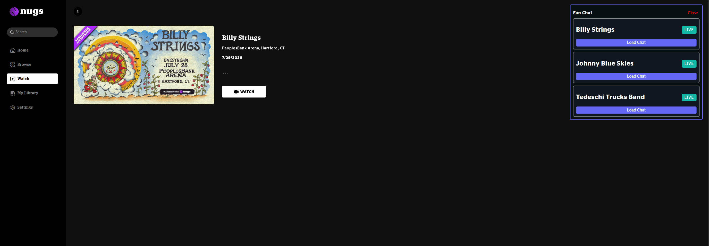
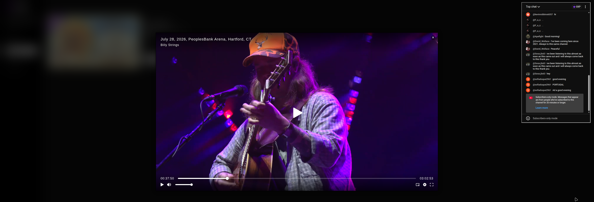

# FanChat

A browser plugin and related infrastructure to embed live chat in to livestreams that don't support chat (such as [nugs](https://www.nugs.net))

## How it works (WIP details tbc)

### Plugin

A user installs the plugin which will then inject an iframe on to the specified website, it also reaches out to a public CDN
Which contains the stream metadata.

From there it will load a YT live chat on to the page allowing them to connect to other users also using the plugin.

### Backend

A pre-encoded file (default is a plain black image but could be anything) is ingested by our deployed services which create a YT stream,
Each stream can then have up to 3 broadcasts (which is where we will embed the chat from)

Once the chat is created, the CDN is updated with the latest data allowing for it to be read downstream
